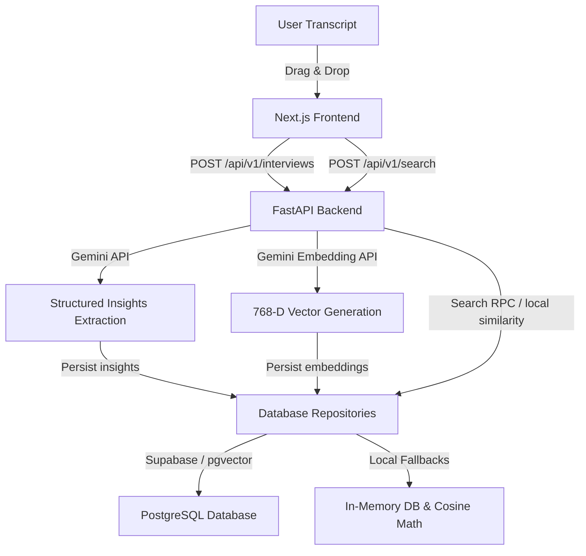

# 🧠 Qualia

### *Evidence-Backed Qualitative Research & AI Synthesis Platform*

[](https://fastapi.tiangolo.com/)
[](https://nextjs.org/)
[](https://www.typescriptlang.org/)
[](https://tailwindcss.com/)
[](https://supabase.com/)
[](https://ai.google.dev/)
[](https://www.python.org/)

Qualia is a qualitative research platform that translates user interview transcripts into evidence-backed insights. It automatically groups recurring themes, extracts feature requests, lists pain points, and verifies every claim with verbatim quotes mapped to the original session context.

---

## 🎯 Value Proposition

Qualitative research synthesis is traditionally a slow, manual process prone to subjective bias. Qualia automates this workflow without sacrificing trustworthiness. By using zero-temperature structured schemas and semantic vector databases, **every insight is strictly grounded in raw interview evidence**.

---

## 🚀 Key Features

*   **🔍 Conceptual Semantic Search**: Search transcripts semantically rather than matching exact keywords using `pgvector` and Gemini embeddings (with pure-python Cosine Similarity fallback).
*   **📊 Dynamic Theme Clustering**: Automatically clusters tags and topics across all uploaded sessions, choosing representative quotes for each cluster.
*   **🗂️ Grounded Evidence Panel**: Displays pain points, feature requests, and positive feedback side-by-side with copy-to-clipboard verbatim quote highlights.
*   **⚖️ Contradiction Detection**: Alerts researchers automatically with warnings when participants express conflicting views during the session.
*   **🫳 Drag & Drop Transcript Reader**: Directly drag and drop transcript text files to parse and populate research details.

---

## 📸 Interface Screenshots

| Dashboard Thematic Clusters | Evidence Panel & Upload |
| :---: | :---: |
|  |  |

---

## 🛠️ Technical Stack

| Category | Technology | Description |
| :--- | :--- | :--- |
| **Backend** | FastAPI, Python | Asynchronous API server handling vector retrieval. |
| **LLM Integrations** | Google Gemini 2.0 | High-fidelity extraction via structured JSON outputs. |
| **Embeddings** | Gemini embedding-001 | Translates text segments into 768-dimension vectors. |
| **Vector DB** | Supabase, PostgreSQL | Stores vectors using `pgvector` for similarity queries. |
| **Frontend** | Next.js 16 (App Router) | Responsive UI with custom component primitives. |

---

## 🏗️ Architecture Overview



---

## ⚡ Quick Start

Boot the FastAPI backend and the Next.js frontend concurrently.

### 1. Run the Backend API (FastAPI)
1. Navigate to the backend folder:
   ```bash
   cd backend
   ```
2. Create and activate a python virtual environment:
   ```bash
   python -m venv .venv
   .venv\Scripts\activate   # Windows
   source .venv/bin/activate # Unix/macOS
   ```
3. Install package requirements:
   ```bash
   pip install -r requirements.txt
   ```
4. Configure environment variables (create a `.env` file inside `backend/`):
   ```env
   GEMINI_API_KEY="your-gemini-api-key"
   SUPABASE_URL="optional-supabase-url"
   SUPABASE_KEY="optional-supabase-anon-key"
   ```
5. Start the development server:
   ```bash
   uvicorn app.main:app --port 8000 --reload
   ```
   *The Swagger API documentation will be available at **`http://localhost:8000/docs`**.*

### 2. Run the Frontend (Next.js)
1. Open a **second terminal** and navigate to the frontend folder:
   ```bash
   cd frontend
   ```
2. Install npm dependencies:
   ```bash
   npm install
   ```
3. Configure the local environment variables (create a `.env.local` file inside `frontend/`):
   ```env
   NEXT_PUBLIC_API_URL=http://localhost:8000
   ```
4. Start the Next.js development server:
   ```bash
   npm run dev
   ```
   *The application will boot up at **`http://localhost:3000`**.*

---

## 💡 Key Technical Decisions

### 1. Zero-Temperature Structured Outputs
Pydantic schemas are passed directly to Gemini’s API configuration (`response_schema`), ensuring responses validate cleanly against the Pydantic type definitions without hallucinated fields.

### 2. Dual-Mode Database Fallbacks
The data repositories are built to support a local fallback state. If Supabase is unconfigured or offline, the repositories serialize models locally and calculate similarity rankings using pure-python Cosine Similarity. This ensures that the system is fully operational locally in offline demo mode.

### 3. Asynchronous Task Delegation
Heavy extraction and embedding generations are executed in Python thread-pool executors to prevent blocking the main FastAPI event loop, maintaining high API throughput.

---

## 🔮 Future Enhancements

*   **🎙️ Audio Upload & Transcription**: Integrate Whisper API or Gemini audio parsing to transcribe and analyze raw audio/video files directly.
*   **🔗 Jira / Linear Integration**: Add a direct integration to generate bug tickets or user stories from pain points with a single click.
*   **📂 Multi-Project Workspaces**: Support dividing interviews into separate workspace folders for distinct research projects.

