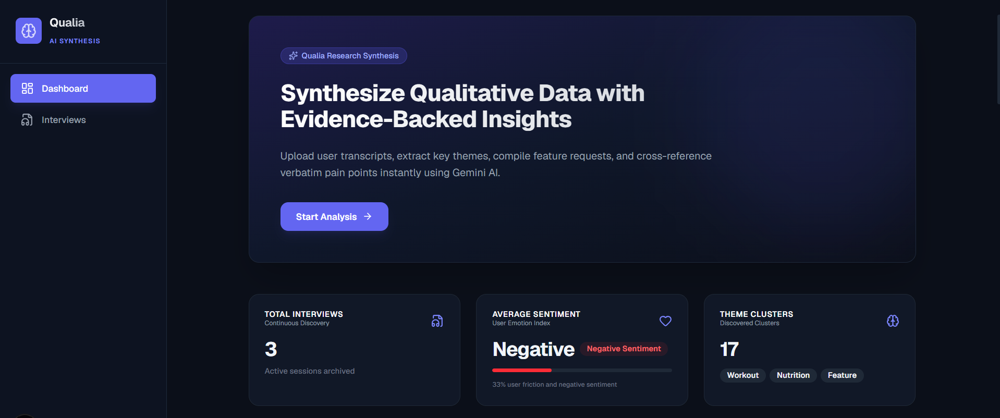
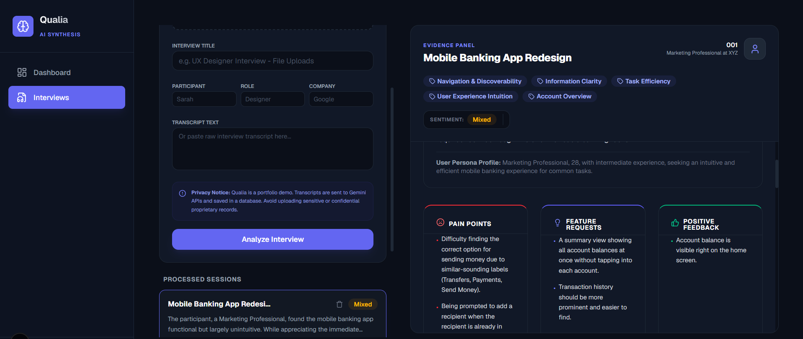
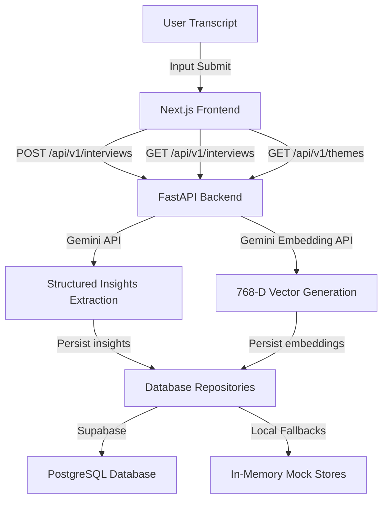

# 🧠 Qualia

### *Evidence-Backed Qualitative Research Synthesis Platform powered by Gemini AI*

[](https://fastapi.tiangolo.com/)
[](https://nextjs.org/)
[](https://www.typescriptlang.org/)
[](https://tailwindcss.com/)
[](https://supabase.com/)
[](https://ai.google.dev/)
[](https://www.python.org/)

Qualia is a qualitative research platform that translates raw user interview transcripts into structured, evidence-backed insights. It automatically clusters recurring themes, extracts feature requests, lists pain points, and validates every claim with verbatim quotes mapped to the original session context.

---

## 🎯 Value Proposition

Qualitative research synthesis is traditionally a slow, manual process prone to subjective bias. Qualia automates this workflow without sacrificing trustworthiness. By using zero-temperature structured schemas and semantic vector databases, **every insight is strictly grounded in raw interview evidence**.

---

## 🚀 Key Features

*   **🛡️ Secure User Session Isolation**: Lightweight, username-based session authentication isolating interview records strictly by user account.
*   **📊 Dynamic Sentiment & Emotion Index**: Real-time user emotion analysis displayed through animated progress bars that dynamically classify ratings (Positive, Mixed, Negative) depending on active sessions.
*   **🧠 Thematic Coding Clusters**: Automatically clusters topics and tags across uploaded transcripts, finding representative quotes and calculating frequencies.
*   **🗂️ Verbatim Grounding Evidence Grid**: Pain points, feature requests, and positive feedback highlights displayed side-by-side with clipboard copy actions.
*   **⚡ Smart Local Fallbacks**: A seamless offline sandbox experience that automatically falls back to an in-memory DB and local cosine-similarity math if Gemini rate limits or Supabase databases are unconfigured.

---

## 📸 Interface Preview

Here are the user interface screens demonstrating the platform's core dashboard and interviews workspace:

| Main Dashboard & Sentiment Metrics | Interview Workspace & Grounding Panel |
| :---: | :---: |
|  |  |

---

## 🛠️ Technical Stack

| Component | Tech | Description |
| :--- | :--- | :--- |
| **Frontend UI** | Next.js 16 (App Router), TypeScript, TailwindCSS | Responsive layout with customized Lucide React icons. |
| **Backend API** | FastAPI, Python 3.11+, Pydantic v2 | High-performance asynchronous endpoint router. |
| **LLM Inference** | Google Gemini API (`gemini-2.5-flash`) | Structured JSON extraction utilizing strict system instructions. |
| **Embeddings** | Gemini `text-embedding-004` | Translates segments into 768-D vectors. |
| **Primary Database** | Supabase, PostgreSQL (`pgvector`) | Vector storage and similarity calculation RPCs. |

---

## 🏗️ Architecture Overview

The following diagram illustrates the flow of raw transcript data through the synthesis engine to visual rendering:



---

## 💡 Key Technical Decisions

### 1. Pydantic-Driven Zero-Temperature Inference
To guarantee zero-hallucination structure compliance, Qualia configures the Gemini client with strict Pydantic definitions ([insight.py](file:///c:/Users/Tanisha%20agarwal/PythonFiles/Engineer%20Surya/Career%20Search/Great%20Questions/qualia/backend/app/schemas/insight.py)) and system instructions. Setting `temperature = 0.0` ensures the model stays strictly grounded inside raw transcript facts.

### 2. Dual-Mode Storage & Offline Sandbox
To accommodate sandbox demos without requiring active API keys or database servers, the repository layer ([interview_repository.py](file:///c:/Users/Tanisha%20agarwal/PythonFiles/Engineer%20Surya/Career%20Search/Great%20Questions/qualia/backend/app/db/repositories/interview_repository.py)) falls back to a clean mock state. It calculates cosine similarity locally using Python's native `math` module if the Supabase client connection fails or goes offline.

### 3. Dynamic Vector Type-Parsing
PostgreSQL `pgvector` responses from Supabase queries return as string representations of float lists (e.g. `'[0.1, 0.2, ...]'`). Qualia uses Pydantic's `@field_validator("embedding", mode="before")` inside [interview.py](file:///c:/Users/Tanisha%20agarwal/PythonFiles/Engineer%20Surya/Career%20Search/Great%20Questions/qualia/backend/app/models/interview.py) to parse these string results into clean python float lists on-the-fly, preventing server-side validation crashes.

---

## ⚡ Quick Start

### 1. Run the Backend API (FastAPI)
1. Navigate to the backend folder:
   ```bash
   cd backend
   ```
2. Setup python virtual environment and dependencies:
   ```bash
   python -m venv .venv
   .venv\Scripts\activate   # Windows
   source .venv/bin/activate # Unix/macOS
   pip install -r requirements.txt
   ```
3. Set up your environment (create a `.env` file inside `backend/`):
   ```env
   GEMINI_API_KEY="your-gemini-api-key"
   SUPABASE_URL="optional-supabase-url"
   SUPABASE_KEY="optional-supabase-anon-key"
   ```
4. Start the server:
   ```bash
   uvicorn app.main:app --port 8000 --reload
   ```
   *FastAPI Swagger documentation will load at [http://localhost:8000/docs](http://localhost:8000/docs).*

### 2. Run the Frontend (Next.js)
1. Open a new terminal and navigate to the frontend folder:
   ```bash
   cd frontend
   ```
2. Install packages:
   ```bash
   npm install
   ```
3. Set environment vars (create `.env.local` inside `frontend/`):
   ```env
   NEXT_PUBLIC_API_URL=http://localhost:8000
   ```
4. Run the Dev server:
   ```bash
   npm run dev
   ```
   *Access the app interface at [http://localhost:3000](http://localhost:3000).*

---

## 🔮 Future Enhancements

*   **🎙️ Audio Transcript Parsing**: Native voice upload handling utilizing Gemini's multimodal audio capabilities.
*   **🔗 Linear & Jira Integrations**: Automatic creation of user stories and engineering tasks directly from flagged pain points.
*   **📂 Multi-Tenant Workspace Projects**: Grouping user interview sessions inside isolated folders.
